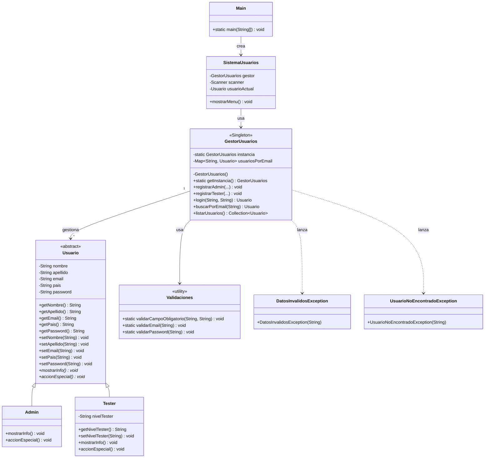

Sistema de Usuarios – Cestore

Proyecto final implementado en Java simula un sistema de gestión de usuarios (administradores y testers).

Funcionalidades

Iniciar sesión: autenticación por email y contraseña.
Registrar administrador: alta de un nuevo usuario Admin.
Alta usuario tester: alta de un nuevo usuario Tester (requiere sesión de administrador activa), con selección de nivel (Junior, Senior o Líder).
Listar usuarios: muestra todos los usuarios registrados en el sistema.
Buscar usuario por email: búsqueda puntual de un usuario.
Cerrar sesión: finaliza la sesión activa.
Salir: termina la ejecución del programa.

Todas las operaciones de alta validan campos obligatorios, formato de email, longitud mínima de contraseña y emails duplicados, lanzando excepciones propias (DatosInvalidosException, UsuarioNoEncontradoException) cuando corresponde.

Diagrama UML

| Admin | yaniscorrea@gmail.com | 12345 |
| Admin | leonardoperez@gmail.com | 12345 |
| Tester | paola291187@gmail.com | Abcde1 |
